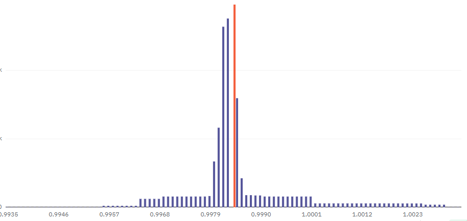

# Uniswap V4 Concentrated Incentives Hook

The Incentives Hook for Uniswap V4 enables protocols to incentive the current active tick enabling them to incentivize deep liquidity around the true price.

Liquidity Mining is a fairly common thing in DeFi, and Uniswap has never had a native liquidity mining program. Even though we've had a few ways to incentivize liquidity (such as Merkle and Position Staking), there has never been an accurate, decentralized and onchain way to incentivize the liquidity providers in a way that makes sense for the protocol.

With this hook for Uniswap V4, it enables protocols to incentivize liquidity providers in a way which is beneficial to them, without needing to constantly monitor the liquidity and adjust the rewards.

As of today, most liquidity mining programs work based on provided liquidity, however this is not a good thing for Concentrated Liquidity since liquidity can be placed outside of the current active range and still earn the rewards. In order to tackle that, most people using Uniswap V3 resort to off-chain compute that often resolves around fees earned. Another method is for the protocol to actively monitor the liquidity and change rewarded ranges frequently, neither of which are ideal.

This idea is inspired by Aerodrome's Slipstream AMM, which is similar to Uniswap V3 however they incentivize the current active tick with veAERO emissions. This hook enables the same incentivization mechanism for Uniswap V4.

Note: This is a PoC, an actual Position Manager would be required to fully utilize this hook.
